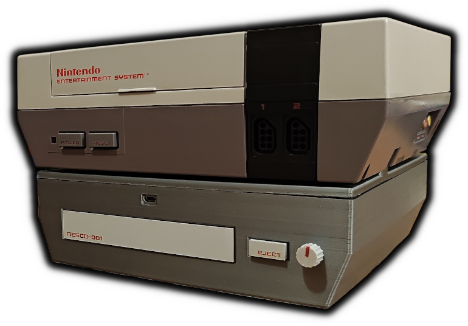
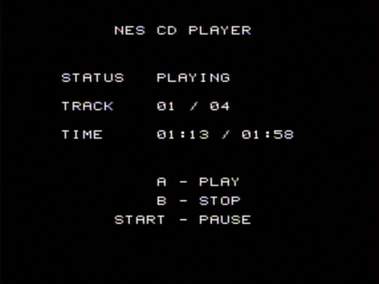

# NESCD-001



An unofficial homemade CD add-on for the NES, just because!

This repo contains the schematics, PCB, 3D printable STLs for the shell, sticker labels, and the firmware.

## How it works

It's basically an RP2350B hooked up to both an Everdrive N8 Pro and an IDE CD drive. It reads the game ROM off the CD, uploads it to the Everdrive over USB
and asks the menu to install it, then watches a mailbox byte in the cart's CHR RAM for the game to ask for music. The RP2350B is the coordinator in the
middle that bridges the NES/Everdrive and the CD drive.

Project video: https://www.youtube.com/watch?v=6D8RWVwW4ZI

## Hardware
- The main PCB (see [pcb/](pcb/))
- A standard 40-pin IDE CD drive
- Everdrive N8 Pro

## Build

```
cd firmware && ./flash.sh
```

## Making a disc

The demo game needs [cc65](https://cc65.github.io/) (`ca65`/`ld65`), plus
`python3` with `numpy`, `ffmpeg` for the audio, and `xorriso` to burn.

```
cd game && make         # demo.nes, four music tracks, and build/demo.img
cd game && make burn    # burn build/demo.img and read it back to check
```

To put your own game on a disc, pass [`mkgamedisc.py`](firmware/tools/mkgamedisc.py)
an iNES ROM and one track per music byte:

```
python3 firmware/tools/mktrack.py theme.wav -o theme.rom --loop-start 4.2
python3 firmware/tools/mkgamedisc.py -o mygame.img --title "MY GAME" --nes mygame.nes --track 1=theme.rom --verify
firmware/burn.sh mygame.img
```

## Using it

If everything goes right, you should be able to just put a burned disc into the CD drive while the NES is on and sitting on the Everdrive menu.
It'll auto-boot the game once it's read and uploaded to the Everdrive.

### Playing an audio CD

Arguably the most practical use for this thing: A CD player!

`make` in the `game` directory also builds `build/cdplayer.nes`. Copy the ROM to the Everdrive's SD card (or push it over USB),
start it from the menu, and put any ordinary audio CD in the drive. I regret not thinking of this very obvious use case in the
video I did this on thing. Oh well!



## FAQ

### What?
Great question! I came up with the idea for this project while reading about the canceled SNES CD-ROM add-on. I was originally going to make my own
version of that add-on, but decided it'd be funnier and weirder if I took it a step further and made one for NES.

### Why?
Because it's fun.

### Who?
It's me! Your old pal - Throaty Mumbo!

### Where are the FMVs you showed in the video?
I chose not to include any FMV-related code here because to get that working I had to semi-reverse engineer
Something Nerdy's [Bad Apple!! Ultimate NES Demake](https://somethingnerdy.com/downloads/), which is currently closed source.
The team has mentioned they're planning to formally open source their MXM mapper (which this demo presumably uses, actually not sure)
once their game *Former Dawn* is released. I didn't feel good about publishing reverse engineered code from an indie development team
for my stupid meme project, especially when they have plans to release it themselves.

### Why not stream audio from the Everdrive?
I originally wanted to do this, but was hitting a ceiling on the Everdrive USB bandwidth. I'd likely have to add some form of aggressive compression
to make room. It's also a nice touch to use the expansion port instead.

The USB cable poking out on the front is by far the biggest blemish on the design of this contraption, so I did look at moving everything to the
expansion port. Unfortunately the bandwidth there is even more limited than the USB route.

Plus, the expansion port audio allows more flexibility with mixing and volume control - hence the volume knob on the front.

### How is this thing powered?
A single molex cable from a wall adapter ([this one](https://www.amazon.com/Coolerguys-100-240v-Molex-Power-Adapter/dp/B000MGG6SC) in particular).
The 5V/12V rails are split between the CD drive and the board + the NES output. I took the end of a spare NES power cable and hooked it up to
a buck converter that converts the 12V input to ~9.5V so you can power the NES as well (the plug pokes out of the top of the box). That way
you only need one wall outlet to get the entire thing running. You can also power the NES separately from its regular adapter - the plug
coming out of the NESCD is optional.

### How do you get back to the Everdrive menu once you've inserted a disc?
This is still something I'm trying to figure out. AFAIK there's no way to trigger a soft reset on the NES. However one guaranteed solution is to
hook up the NES power output rail to a relay switch. That way if the board ever needs the NES to reset, it can just turn it on and off from the
source. Not super elegant but it should work.
